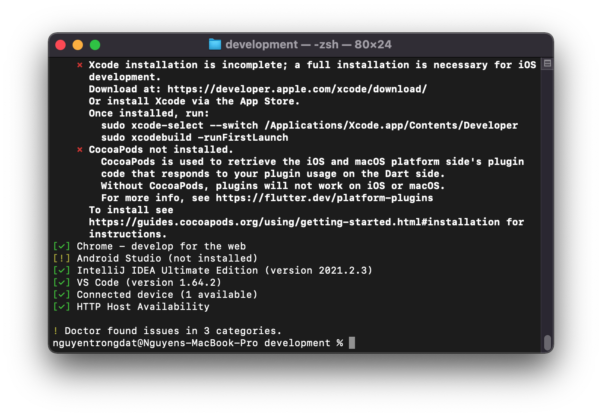

# MobileHomework

### Week1 :
Lesson 1 :

- Giới thiệu Flutter

Lesson 2 :

Lesson 3 : completed

Lesson 6 : completed

## Input/Output

Input : Tập train và test.

Tập train : Gồm 3 trường dữ liệu :

- qid : id của câu hỏi
- question_text : Nội dung câu hỏi
- target : Nhãn của câu hỏi phân loại câu hỏi bằng hai giá trị là 0, 1 với 0 là các câu hỏi "**sincere**" và 1 là các câu hỏi "**insincere**"
- Có 1225312 nhãn 0, 80810 nhãn 1

Tập test : Gồm 2 trường dữ liệu :

- qid : id của câu hỏi
- question_text : Nội dung câu hỏi